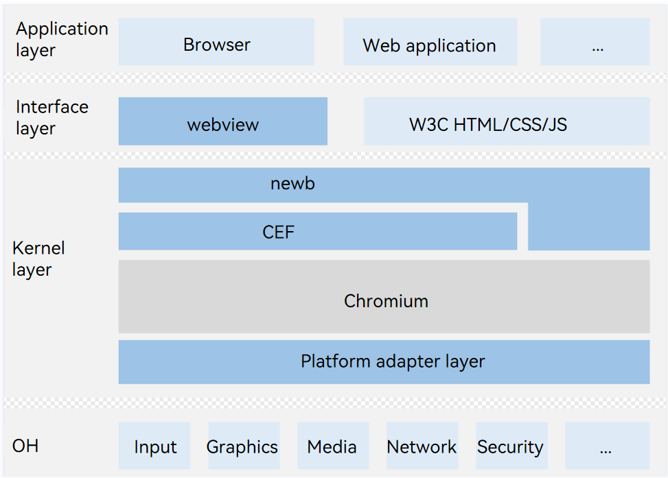

# Chromium

## Introduction
Chromium is an open-source web browser principally developed by Google and from which Google Chrome draws its source code. It is released under the BSD license and other permissive open-source licenses, aiming to build a safer, faster, and more stable way to experience the Internet.

OpenHarmony nweb is built on Chromium.

## Software Architecture
Below is the software architecture.



* webview: UI component in OpenHarmony.
* nweb: native engine of the OpenHarmony web component, which is built based on the Chromium Embedded Framework (CEF).
* CEF: short for Chromium Embedded Framework, an open-source project based on Google Chromium.
* Chromium: an open-source web browser principally developed by Google and released under the BSD license and other permissive open-source licenses.
## How to Use
1. Fork the **chromium_src** repository to your own repository (remote repository).
   
   > **NOTE**
   >
   > There are many Chromium repositories, you can find the directory mappings in the [chromium.xml](https://gitee.com/openharmony-sig/manifest/blob/master/chromium.xml) file. The **chromium_src** repository here is an example.
   
2. Download the full code.

    repo init -u https://gitee.com/openharmony-tpc/manifest -b chromium -m chromium.xml --no-repo-verify

    repo sync -c

    repo forall -c 'git lfs pull'

3. Build the code.

    To build an unsigned HAP file, run **./build.sh -t w -A rk3568**

    To build only the .so libraries, run **./build.sh -A rk3568**.

    ***If you cannot find the SDK package, download the large file.***

    cd src

    git lfs pull

4. Sign the HAP file.

   Run **./sign.sh** to sign the HAP file.

5. Debug the code.

    - Method 1: replacing the .so libraries

      After the build is complete, find the . so libraries in the **out** directory and push them to the device.
      
      ```
      hdc shell "mount -o remount,rw /"
      hdc file send libnweb_render.so /data/app/el1/bundle/public/com.ohos.nweb/libs/arm
      hdc file send libweb_engine.so /data/app/el1/bundle/public/com.ohos.nweb/libs/arm
      pause
      hdc shell reboot
      pause
      ```
      
    - Method 2: replacing the HAP file

      After the build is complete, find **NWeb-rk3568.hap** in the **out** directory and push it to the device.

      ```
      hdc shell "mount -o remount,rw /"
      hdc file send NWeb-rk3568.hap /system/app/com.ohos.nweb/NWeb.hap
      hdc shell "rm /data/* -rf"
      hdc shell reboot
      ```

6. Add the code to the staging area.

    Run the **git add** command to add the modified files to the staging area.

7. Check the status of the workspace and staging area.

    Run the **git status** command to check whether your modifications are stored in the staging area. Run the **git log** command to view historical project information.

8. Commit the content in the workspace or staging area to the local repository.

    Run the **git commit -sm** command to commit the modified files. Note that **-s** must be included, and you must sign DCO first. Otherwise, a DCO error will be reported when the PR is submitted.

    To sign DCO, visit **https://dco.openharmony.cn/sign-dco**.

9. Push the code to the remote repository.

    Example: git push https://gitee.com/[giteeUserName]/chromium_src

10. Create a PR.

    If joint build is involved, create an issue and bind the issue to all the involved PRs.

11. Comment on "start build" under the PR.

12. Contact the committer to merge the PR.

13. Branch information

   ```
   master: chromium-99 kernel
   master114_20231127: chromium-114 kernel，current master branch
   master114_20231218: corresponding to OpenHarmony-4.1-Beta1 branch
   ```
