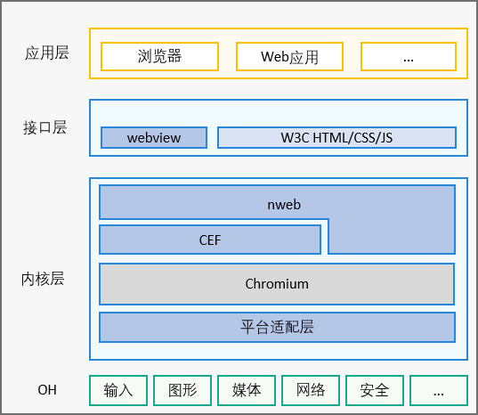

# Chromium
## 简介
### 软件架构
软件架构说明

* webview组件：OpenHarmony的UI组件。
* nweb：基于CEF构建的OpenHarmony Web组件的Native引擎，主要构建Web组件浏览器内核的部分能力。
* CEF：CEF全称Chromium Embedded Framework，是一个基于Google Chromium 的开源项目。
## 使用说明
1. 下载代码：以主干(master)为例，要下载其他分支代码请替换-b 后带的manifest分支参数，参数列表详见8。下载114_trunk分支代码时需要将-m 后的参数由chromium.xml替换为developer.xml。
    ```
    repo init -u https://gitcode.com/openharmony-tpc/manifest -b chromium -m chromium.xml --no-repo-verify
    repo sync -c
    repo forall -c 'git lfs pull'
    ```

2. 执行预编译下载，安装编译工具链及Sdk。
    ```shell
    ./prebuilts_download.sh
    ```

3. 编译
   
    编译同时构建未签名Hap包：
	
	形态：rk3568
	```
	./build.sh  -t w -A rk3568
    ```
    仅编译so库：
	```
	./build.sh -A rk3568
    ```
	
	形态：rk3568_64
	```
	./build.sh  -t w -A rk3568_64
    ```
    仅编译so库：
	```
	./build.sh -A rk3568_64
    ```

4. 签名

    形态：rk3568
    ```
    ./sign.sh rk3568
    ```
    形态：rk3568_64
    ```
    ./sign.sh rk3568_64
    ```

5. 调试方法

    方法一：替换so库

    编译完成后，在out目录下找到对应so库产物，将它们推送到设备中
    ```
    hdc shell "mount -o remount,rw /"
    hdc file send libnweb_render.so /data/app/el1/bundle/public/com.ohos.nweb/libs/arm
    hdc file send libweb_engine.so /data/app/el1/bundle/public/com.ohos.nweb/libs/arm
    pause
    hdc shell reboot
    pause
    ```

    方法二：替换hap包
    
    编译完成后，在out目录下找到NWeb-rk3568.hap或者NWeb-rk3568_64.hap, 将它推送到设备中。

    ```
    hdc shell "mount -o remount,rw /"
    hdc file send NWeb-rk3568.hap /system/app/com.ohos.nweb/NWeb.hap
    hdc shell "rm /data/* -rf"
    hdc shell reboot
    ```
6. 所有Chromium仓对应目录映射关系

    https://gitcode.com/openharmony-tpc/manifest/blob/chromium/chromium.xml

7. 上库指导

    7.1 将chromium_src 仓 fork到自己的私仓

    7.2 下载全量代码

    7.3 修改调试代码

    7.4 将文件添加到暂存区

    使用git add将修改后的文件添加到暂存区

    7.5 显示工作区和暂存区的状态

    使用git status查看自己的修改是否放到暂存区，查看项目历史信息使用git log。

    7.6 将工作区内容或暂存区内容提交到版本库

    使用git commit -sm”提交信息描述” 将修改后的文件进行提交，***注意-s一定不能漏，这个是签名，否则提的PR会报DCO错误***。

    DCO签署链接：***https://dco.openharmony.cn/sign-dco***

    7.7 将代码提交到对应fork出来的私仓地址上

    如：git push ***https://gitcode.com/[gitcodeUserName]/chromium_src***

    7.8 新建PR

    7.9 如果涉及联合构建，建立ISSUE，并在需要联合构建的PR中都绑定该ISSUE

    7.10 在PR下面评论start build开始构建

    7.11 联系committer加分

8. chromium各版manifest分支名

    99分支：chromium

    114分支：114_trunk

    配套OpenHarmony 3.2Release分支：3.2_Release

    配套OpenHarmony 4.0Release分支：4.0_Release

    配套OpenHarmony 4.1 Beta1 分支：master114_20231218

## 相关仓
[chromium_cef](https://gitcode.com/openharmony-tpc/chromium_cef)

[chromium_third_party_ohos_nweb_hap](https://gitcode.com/openharmony-tpc/chromium_third_party_ohos_nweb_hap)

